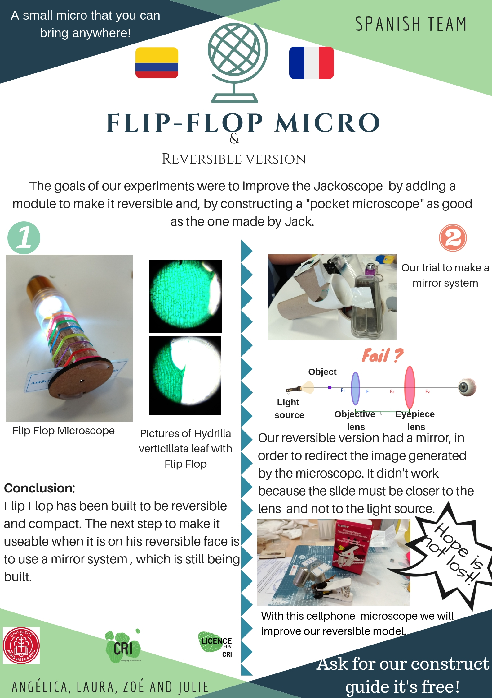

THE SPANISH TEAM welcomes you !

Objectifs

Our objective with Flip Flop was to construct a cheap, pocket size and easily to build microscope that can be reversible. 

This microscope claims to open the exploration of the small objects, because of its size you can bring it everywhere and it can be adapted to various situations. 

The reversible model can help you to study not only slides but also cell culture in petri boxes. This microscope model will become a This prototype needs a bigger version in order to function with this kind of instrument, however the materials used allow the model to be an easy option to create a portable one even if it would be bigger.

Who we are ? 
Zoé, Laura, Angélica, Julie et Carlotta!

